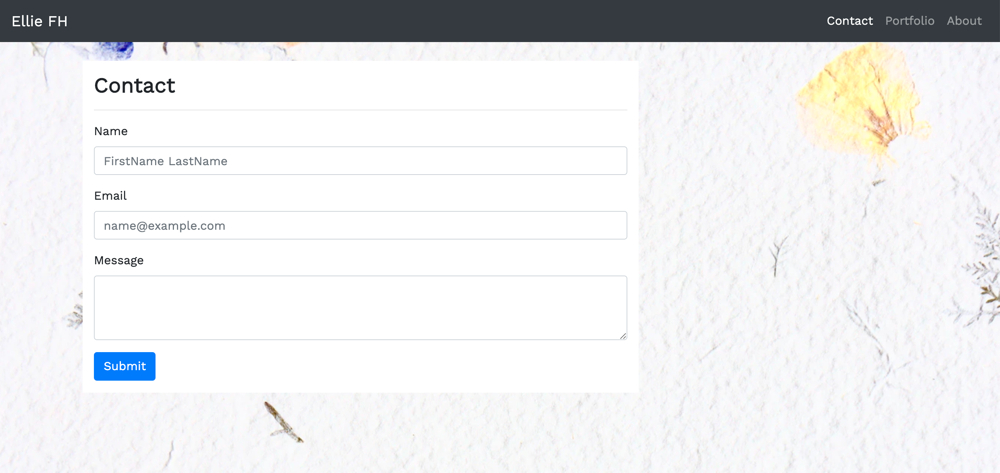
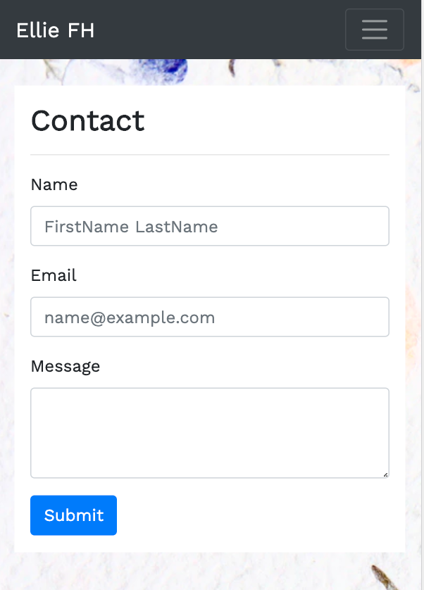
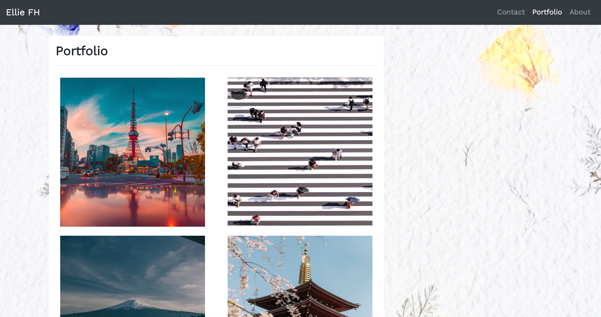
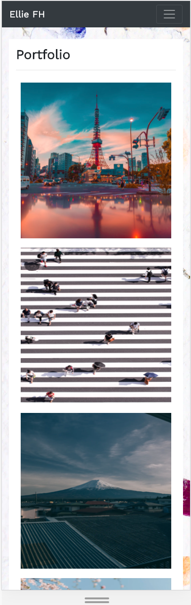
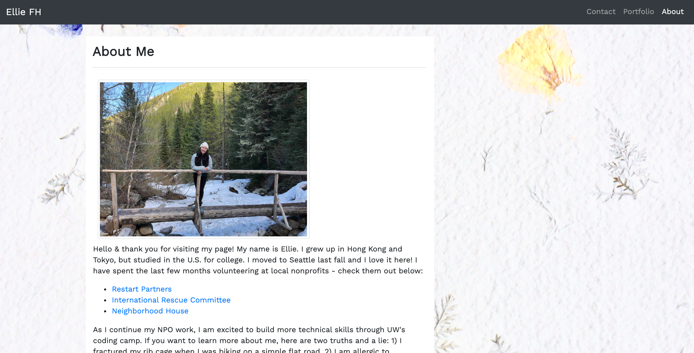
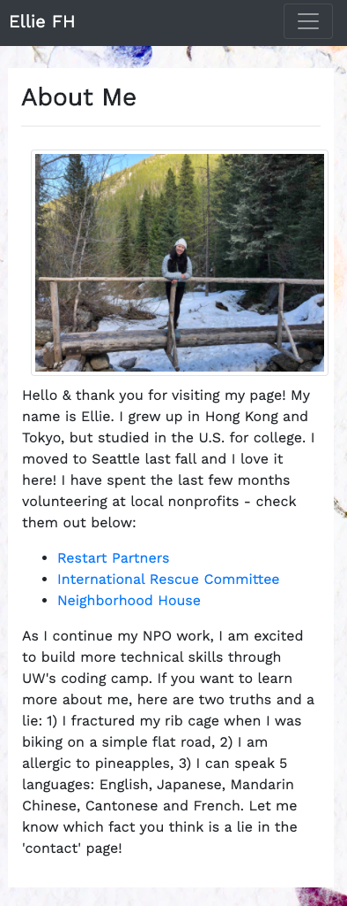

# responsive-portfolio using HTML, CSS and Bootstrap
# Table of Contents

- [responsive-portfolio using HTML, CSS and Bootstrap](#responsive-portfolio-using-html-css-and-bootstrap)
- [Table of Contents](#table-of-contents)
  - [General Info](#general-info)
  - [Resources](#resources)
  - [Code Overview](#code-overview)
  - [Screenshots](#screenshots)

## General Info 
Created a portfolio website with a responsive design that ensures web applications render smoothly on a variety of devices, windows, and screen sizes. 

## Resources

This project was created with the help of:
- [Bootstrap](https://getbootstrap.com/)
- [W3 Schools](https://www.w3schools.com/)
- [UW Bootcamp](https://bootcamp.uw.edu)

## Code Overview
Each HTML file constructs a unique page in the portfolio website. The navigation bar is consistent across each HTML file to allow users to jump around each page smoothly. The main content of the HTML files differ (contact page, about me page, and portfolio page), but all are designed to be mobile responsive. In a larger screen, each page display the main content on the left side; as the screen size shrinks, each page adjust accordingly to fully display the website content. As a bonus exercise, a sticky footer is included in the footer section. 

## Screenshots

